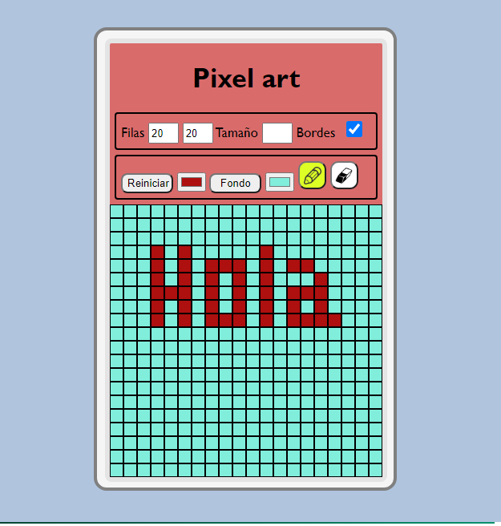

<h2>Pixel Art<h1>

La idea de este proyecto es crear una cuadricula en la que se puede pintar y dibujar

link del proyecto: https://sznitowski.github.io/pixelArt/

  
<ol>
<li><h4>Estructura Html</h4></li>
<ul>
<li>En un div tenemos dos inputs type "number", con el que vamos a definir la cantidad de filas y de columnas, usando el botón "Reiniciar".</li>
<li>En el mismo div tenemos otro input type "number" que nos va a permitir cambiar el tamaño de nuestras celdas. Ademas tendremos un "checkbox" que nos permitirá quitar o agregar los bordes.</li>
<li>En el segundo div tenemos un boton "reiniciar" que nos genera las cuadriculas, un input tipo "color" que será el color del lapiz</li>
<li>También tendremos otro botón, con un input "color" este determinara el color del fondo. y además un lapiz y una goma.</li>
<li>Y un tercer div, en el cual se van a generar las grillas o cuadriculas, estos tres divs, estaran en un div principal.</li>
</ul>

<li><h4>Lógica con javasCript</h4></li>
<ul><li>Traemos todos los elementos del html que vamos a usar, con el "id" del html usando document.getElementById(). Establecemos las constantes<li>
<li>Utilizamos el evento addEventListener(), en una función, con un evento "click", luego calculamos la cantidad de cuadriculas o grillas que vamos a generar, multiplicando "input1.value" * "input2.value"</li>
<li>Creamos un for, para recorrer el numero de cuadriculas, tambien creamos un evento "click" para pintar(lapiz) y otro para borrar(goma).</li>
<li>Creamos otro evento "click" que nos va a permitir pintar el fondo, y un for para recorrer las cuadriculas</li>
<li>Se crea otro evento que nos va a permitir con "checkbox" ocultar las cuadriculas, solo dejando visible el fondo.</li>
<li>Por último creamos un evento que nos va a permitir agrandar o achicar el tamaño de las cuadriculas.</li>
</ul>
<h4>Estilos con css<h4>
</ol>
